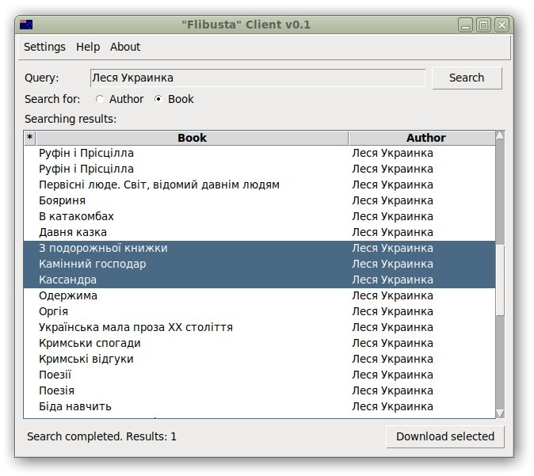

# Flibusta website client



Simple Flibusta website client.

## Features
- Find books and authors.
- Download books in selected format.
- Ability to download all books of an author.
- UI in several languages.
- If a book is inside archive, the program will uncompress it.

## How to Run this Project

Install dependencies:

```sh
pip install -r requirements.txt
```

And then run the program:

```sh
python main.py
```

## How this Project is Implemented

Tech stack:

- FLTK
- BeautifulSoup
- `requests`

The program actually **scrapes** Flibusta website contents and extracts all the search results, books, and links.

/Though, I should've used just OPDS protocol, but I didn't know Flibusta supported it/.
